# VK Cloud Lambda

---

Бессерверный сервис вычислений, позволяющий запускать пользовательский код при определенных событиях.
Аналог **AWS Lambda**

## Содержание

1. [Запуск приложения](#запуск-приложения)
2. [Гайд](#гайд)
   - [Создание проекта](#создание-проекта)
   - [Редактор](#редактор)
   - [Создание функции](#создание-функции)
   - [Ваше хранилище и запуск функции](#ваше-хранилище-и-запуск-функции)
   - [Логи функции](#логи-функции)
   - [Информация о событии](#информация-о-событии)
   - [Тайм-аут и изменение параметров функции](#тайм-аут-и-изменение-параметров-функции)
   - [Удаление функции и проекта](#удаление-функции-и-проекта)
   - [Предупреждение при создании новой версии](#предупреждение-при-создании-новой-версии)
   - [Предупреждение при откате](#предупреждение-при-откате)
3. [Разработчикам](#разработчикам)


## Запуск приложения
Для запуска склонируйте репозиторий и запустите команду

```docker compose --env-file .env.example up -d --build```

Проверьте, чтобы следующие порты были свободны:
- 80
- 8001
- 8002
- 8003
- 9000
- 9001
- 9002
- 9003
- 8500
- 6379
- 9092
- 5433

## Гайд

После запуска контейнеров в браузере перейдите на ```http://localhost/app/project123456/services/lambda/start```.
Перед вам откроется стартовая страница.

**Важно!** Термин **функция** будет использоваться для описания данных созданного вами события. Термин **обработчик** будет
использоваться для обозначения вызываемого объекта в пользовательском коде, например ```def func(arg1, arg2)``` в Python.

### Создание проекта

Нажмите на кнопку ```Создать проект```.

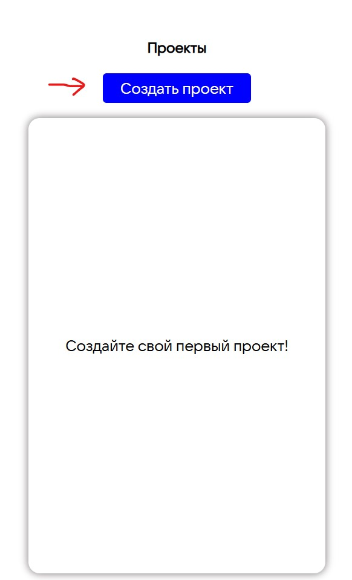

Введите название проекта (минимум 3 символа).

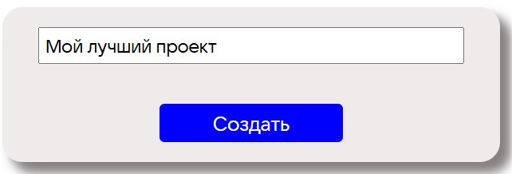

### Редактор

После создания вам откроется полноценный редактор кода. В нем вы можете свободно писать код, создавать папки и файлы,
а также загружать файлы с вашего компьютера. Нажатие правой кнопки мыши открывает меню с действиями:
- Загрузить файл
- Создать файл
- Создать папку

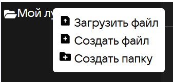

Нажатие на **Создать файл/папку** создает файл/папку в соответствующей директории. После нажатия требуется задать имя 
и нажать **Enter**. При этом, если оставить поле пустым, то создатся файл/папка с названием ```new```. Однако после
перезагрузки страницы такие объекты удаляются. Поэтому всегда задавайте непустое и корректное имя файла.

Корректным названием считается последовательность символов, состоящее из букв, цифр, точки, тире и нижнего подчеркивания.
Символы, например, такие, как скобки, запятая, знак процента не допускаются, и название окрашивается в красный фон. Если
нажать **Enter** после ввода некорректного имени, то оно будет переименовано в ```new```, а файл после перезагрузки удалится.

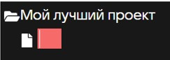
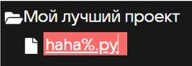

Если кликнуть по файлу или по папке (но не корневой), появляется дополнительная функция **Удалить**.

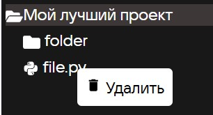

При загрузке файла требуется выбрать файл с диска. Для тестирования вызова функции можно использовать Python скрипт
[test_script.py](test_scripts/test_script.py), находящийся в папке ```test_scripts```. Ее можно найти в корне исходников 
моего проекта.

Нажатие на файл открывает его содержимое. При первом открытии возможно придется чуть подождать, чтобы он подгрузился с
сервера. После внесений изменений в файл необходимо нажать на кнопку ```Сохранить```.

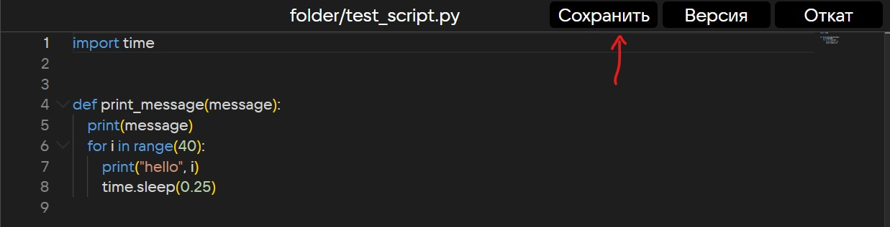

Когда ваш код готов, нужно **обязательно** нажать на кнопку ```Версия```. Это создаст архив на сервере с вашим проектом, 
который будет загружаться при вызове вашей функции из этого проекта.

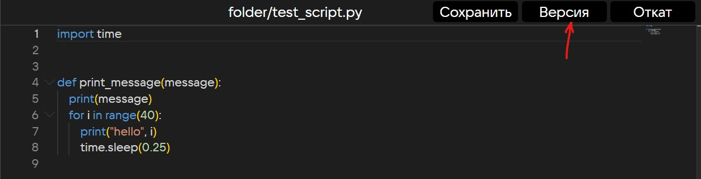

Если по какой-то причине вам необходимо откатится на предыдущую версию проекта, то для это есть кнопка ```Откат```.

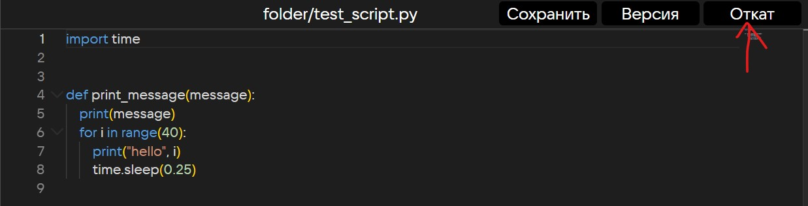

Существует два вида отката:
- Мягкий откат
- Жесткий откат

Мягкий откат просто удаляет текущую версию проекта. Актуальной версией становится предыдущая. 
Аналогичен ```git reset --soft``` в git.

Жесткий откат делает то же самое, что и мягкий, но загружает все файлы, которые были на момент последнего создания версии.
Аналогичен ```git reset --hard``` в git.


После создания версии вернитесь на стартовую страницу, нажав 2 раза по кнопке **Назад**.

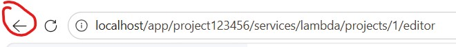

Далее в списке с вашими проектами нажмите на этот проект. В правом окне отобразится подробная информация о проекте. Из
интересных особенностей будет выведено процентное соотношение используемых языков в проекте. Доступные языки: Python, Java
и JavaScript. Остальные языки будут отображаться как Others.

### Создание функции

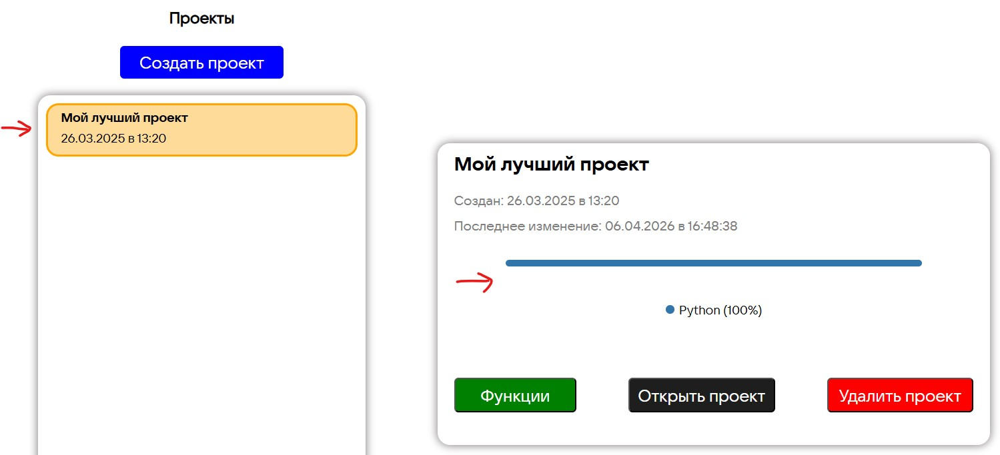

Далее нажимаем на кнопку ```Функции```. Вы перейдете на страницу со списком ваших функций. Пока что у вас их нет, так что
давайте создадим первую. Для этого нажимаем на ```Создать функцию```.

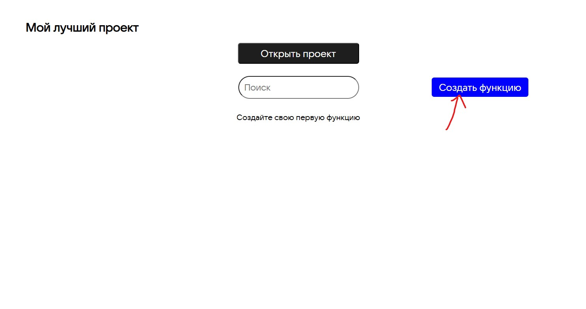

Теперь заполняем данные функции. При выборе сервиса _Хранилище S3_, появятся дополнительные поля с вводом данных S3. 
Все поля обязательные, кроме ```префикса``` и ```суффикса```. Первый отвечает за папку, в которой лежит файл. Второй за
конец названия файла, например:
- префикс: "folder1/folder2" и суффикс: ".pdf" - означает, что функция сработает только, если произвелись действия с файлами
в папке "folder1/folder2" с расширением ".pdf".
- префикс: "folder1/folder2/my.pdf" и пустой суффикс означает, что функция сработает, только если произвелись действия с
файлом с названием "my.pdf" в папке "folder1/folder2".
- пустой префикс и суффикс означает, что функция сработает для любых файлов в любой директории.

Для примера оставим оба эти поля пустыми.

В поле Бакет укажите "my-bucket". Чуть позже будет сказано почему.

Пример заполненных данных. **Поставьте тайм-аут 15 секунд!**

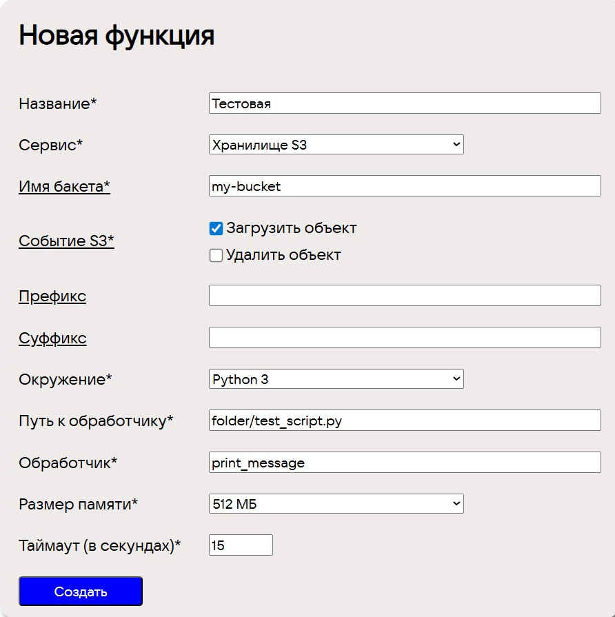

**Интересная фишка!** Если в качестве файла с обработчиками вы укажете файл с расширением ```.py``` (Python), и код в файле
не будет содержать синтаксических ошибок, вам будут выведены все объявленные функции в нем. Очень удобно!

Нажимаем кнопку создать. Нас перебрасывает на предыдущую страницу, и теперь наша созданная функция отображается в списке.

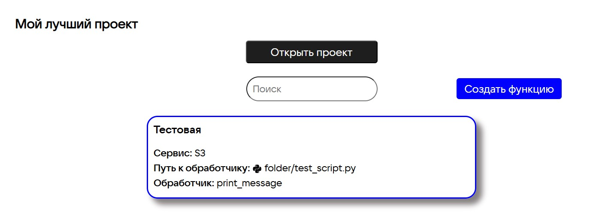

Нажмите на функцию. Откроется страница с подробным ее описанием (вся информация, введенная вами на странице создания функции).

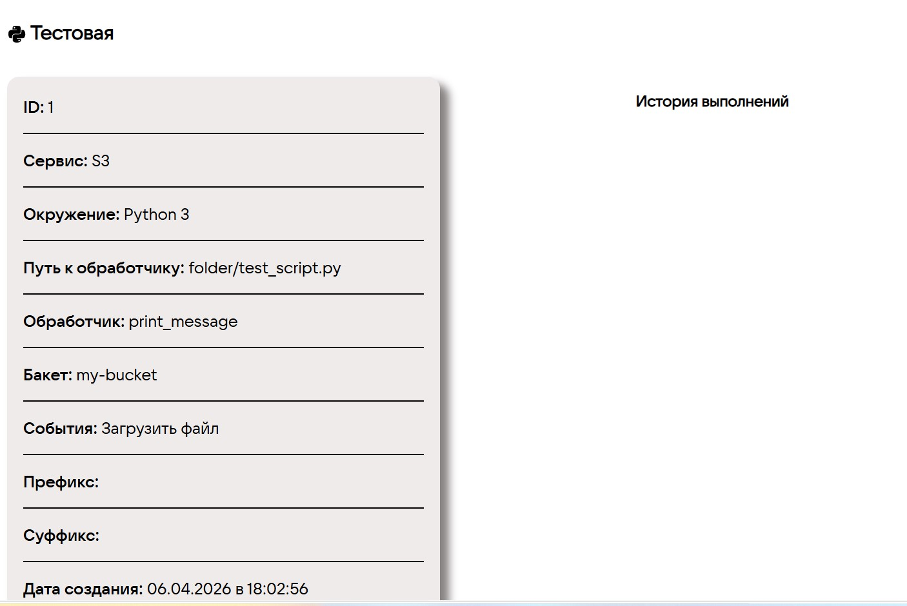

Обратите внимание на раздел ```История выполнений```. Здесь будут отображаться логи (вывод) каждого запуска этой функции.

### Ваше хранилище и запуск функции

Давайте же протестируем работу этой функции на событие загрузки.

Предположим, что вы арендовали некоторый объем хранилища S3. В качестве такого хранилища выступает хранилище ```minio```
как раз на базе S3. Оно доступно по адресу http://localhost:9003. Перейдите **в новой вкладке** в браузере по этому адресу 
и введите имя и пароль. По умолчанию:
```
Username: minio
Password: minio123
```

Они хранятся в файле [.env.example](.env.example) в переменных ```MINIO_MY_ROOT_USER``` и ```MINIO_MY_ROOT_PASSWORD``` 
соответственно.

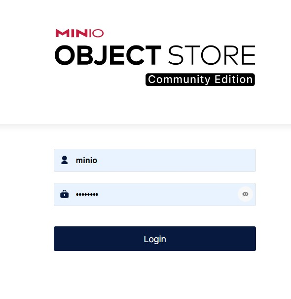

Всё, что подчеркнуто на следующем изображении, и есть название бакета.

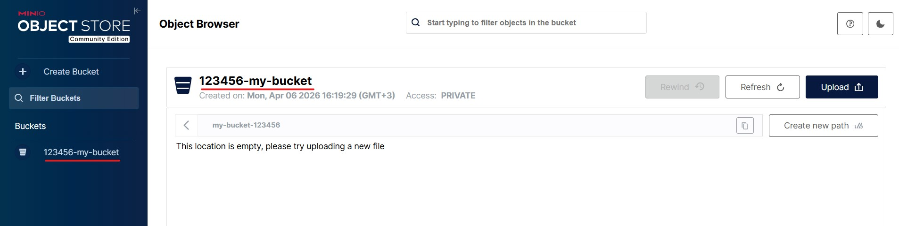

Обратите внимание на название. Оно состоит из ID пользователя и самого названия бакета, разделенных дефисом. Это сделано для
того, чтобы несколько пользователей могли создавать бакеты с одинаковым названием. Ваш ID по умолчанию ```123456```. Он
хранится в файле [frontend/.env.example](frontend/.env.example) в переменной ```VITE_USER_ID```.

**Важно!**
В форме, где вы вводите данные вашей новой функции, нужно писать именно название бакета без ID. В данном случае в хранилище
название бакета ```123456-my-bucket```, значит в форме необходимо указывать просто ```my-bucket```. Если вы собираетесь создать
новый бакет, обязательно указываете ID в начале.

Нажмите на кнопку ```Upload``` и выберете файл для загрузки в ваше хранилище. После перезагрузки быстро вернитесь
на страницу с приложением.

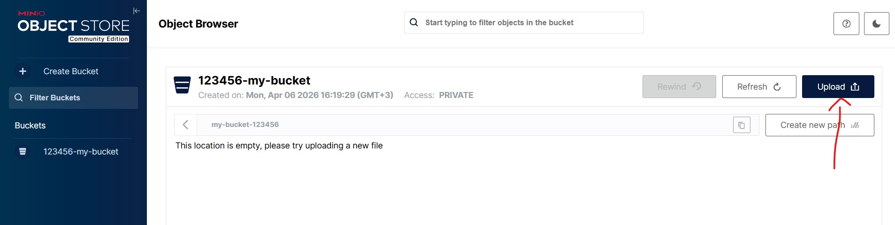

### Логи функции

В разделе **История выполнений** будет отображена запустившаяся функция со статусом ```Выполняется```.

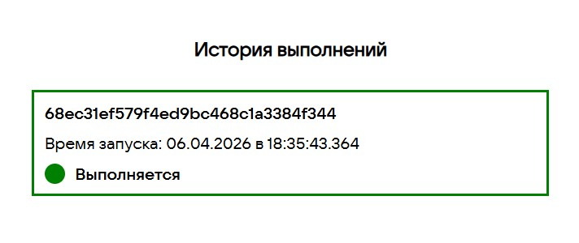

Нажав на нее, вы перейдете на страницу, где будут выводиться логи вашей функции. Так как в 
[test_script.py](test_scripts/test_script.py) стоит задержка в четверть секунды ```time.sleep(0.25)```, логи будут выводится
постепенно, и вы сможете отследить их выполнение. Если вы перезагрузите эту страницу, текущие логи восстановятся и вывод
логов продолжится.

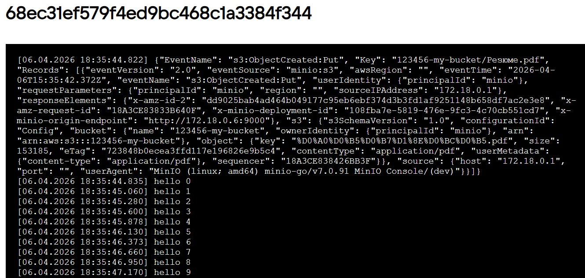

### Информация о событии

Обратите внимание на первый вывод большого json-объекта ```{"EventName": "s3:ObjectCreated:Put", ...```. В нашем коде в
функцию print_message мы передавали аргумент message. 

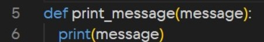

В первый аргумент обработчика передается информация о событии, которое создает S3 или другой сервис. Его можно использовать
для анализа события прямо в вашем коде.

### Тайм-аут и изменение параметров функции

Если вдруг вы заметите, что время выполнения вашей функции является целом числом без наличия дробной части, в 99,9% случаях
значит, что ваша функция завершилась по указанному вами тайм-ауту. В таком случае требуется либо увеличить тайм-аут, либо
проверить ваш обработчик в коде на наличие алгоритмических ошибок.

Чтобы изменить параметры функции, нажмите на значок карандаша внизу раздела с описанием функции.

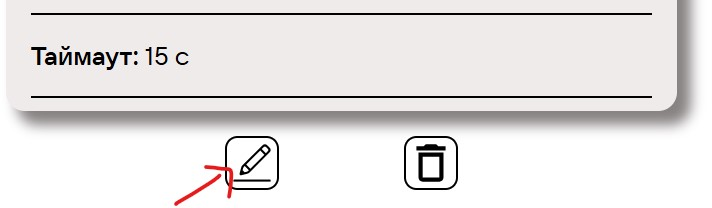

Вы можете изменить не только значение тайм-аута, но также и путь к обработчику, сам обработчик и размер выделяемой
памяти.

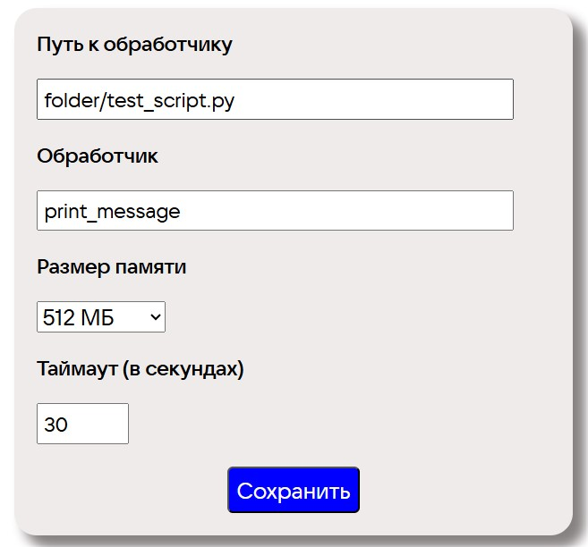

### Удаление функции и проекта

Чтобы удалить функцию, нажмите на значок мусорного ведра.

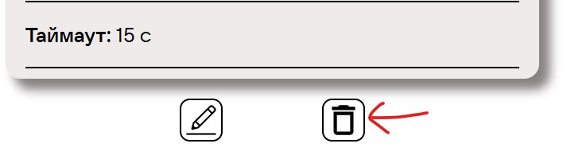

Чтобы удалить проект, нажмите кнопку ```Удалить``` на стартовой странице.

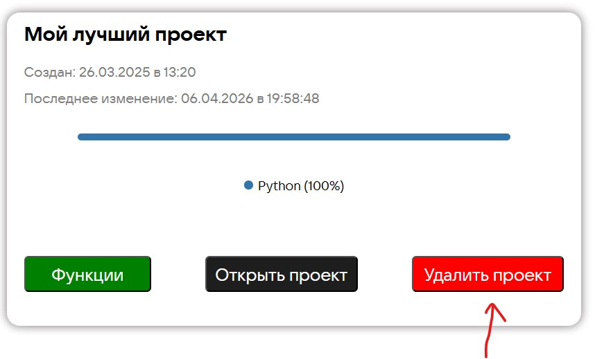

### Предупреждение при создании новой версии

Если вы удалите файлы с кодом, в которых находились ваши обработчики на функции, и сохраните версию проекта, вам будет 
выведено предупреждение.

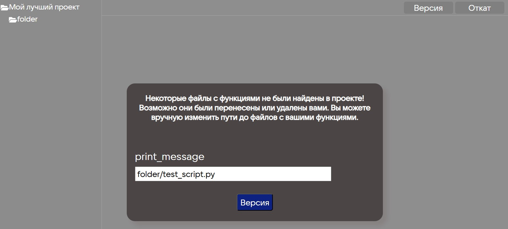

Вы можете изменить путь до файлов с обработчиком или оставить как есть. Если вы решили, что вам эта функция больше не нужна, то
удалите ее до или после создания новой версии.

### Предупреждение при откате

Если вы создали новую версию проекта, после создали функцию, а затем решили откатиться до предыдущей версии проекта, вам
выведено предупреждение:

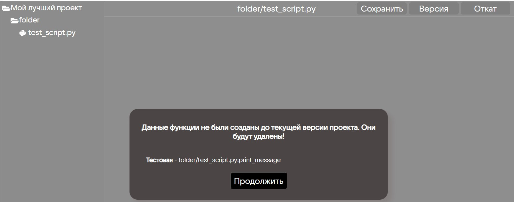

Его смысл в том, что откат в такой ситуации может привести к непредсказуемым последствиям. Поэтому после нажатия кнопки
продолжить произойдет откат версии с последующим удалением всех конфликтующих функций.

## Разработчикам

Описание этого раздела появится позже.